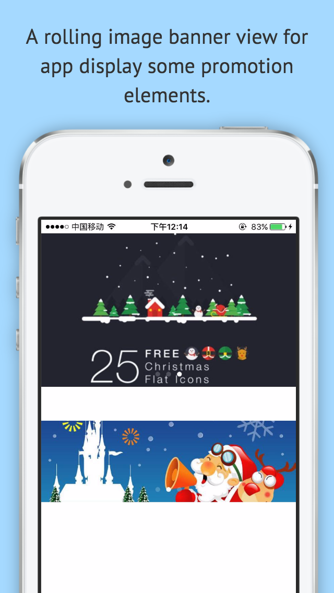

# Reindeer

[](https://travis-ci.org/Evilcome/Reindeer)
[](http://cocoapods.org/pods/Reindeer)
[](http://cocoapods.org/pods/Reindeer)
[](http://cocoapods.org/pods/Reindeer)

A rolling image banner view for app display some promotion elements, support remote image and auto rolling. You can use both autolayout and programming to create the banner view.



## Feature

[x] Image banner
[x] Remote image and local banner
[x] Tapped block
[x] page control
[x] auto rolling
[x] autolayout support

## Installation

Reindeer is available through [CocoaPods](http://cocoapods.org). To install
it, simply add the following line to your Podfile:

```ruby
pod "Reindeer"
```

## Usage

To run the example project, clone the repo, and run `pod install` from the Example directory first.

```swift
if let banner = segue.destinationViewController as? BannerPageViewController {

    // (Optional) Set the rolling interval, 0 means no auto-rolling
    banner.interval = 5

    // (Optional) Set placeholder image
    banner.placeholderImage = UIImage(named: "placeholder")

    // (Optional, Need with Remote Images) Set remote image fetcher
    banner.setRemoteImageFetche({ (imageView, url, placeHolderImage) -> Void in
        imageView.kf_setImageWithURL(NSURL(string: url)!, placeholderImage: placeHolderImage)
    })

    // (Need) Set images
    banner.images = [
        "https://cdn-ifnotalk-com.alikunlun.com/images/3/cd/cbf38bc67d58fb61c42a14f6b468c.jpg",
        UIImage(named: "reindeer-1"),
        UIImage(named: "reindeer-2")
    ]

    // (Optional) Set banner tapped hander
    banner.setBannerTapHandler({ (index) -> Void in
        print("banner with index \(index) tapped.")
    })

    // (Optional) Start auto rolling
    banner.startRolling()
}

```

